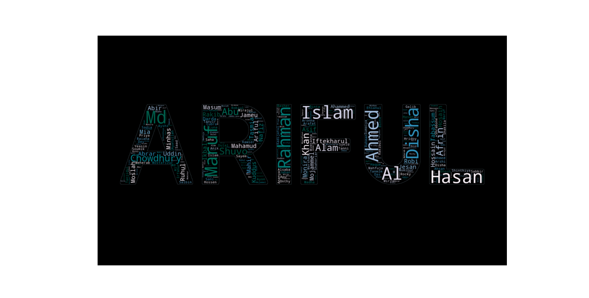
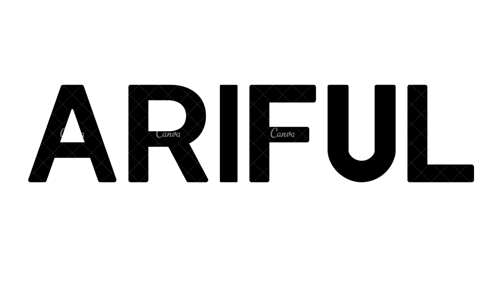

# WordCloud Generator

This repository demonstrates how to create a custom WordCloud using Python. The script reads text from a file, processes it, and generates a WordCloud in the shape of a specified mask image.

## Features

- Generates a WordCloud with up to 500 words.
- Customizable background color and colormap.
- Uses a mask image to shape the WordCloud.
- Outputs a visually appealing WordCloud.

## How It Works  

- **Input Text**: The script reads text data from a file (`CSE_64_K.txt`).  
- **Mask Image**: The shape of the WordCloud is based on a black-and-white mask image (`Arif.png`).  
- **WordCloud Generation**: The script processes the text and fills the mask shape with words.  
- **Visualization**: The WordCloud is displayed using Matplotlib for viewing and saving.  

---

## Output

Below is an example of the generated WordCloud:

### WordCloud Output:


### Mask Image:
The WordCloud is shaped based on the following mask image:


## Installation

Step 1 : 

Clone this repository

```bash
   git clone https://github.com/your-username/wordcloud-generator.git
   cd wordcloud-generator
```

Step 2 :

Install required Python packages

```bash  
  pip install wordcloud numpy pillow matplotlib
```

Step 3 :

Run the code


